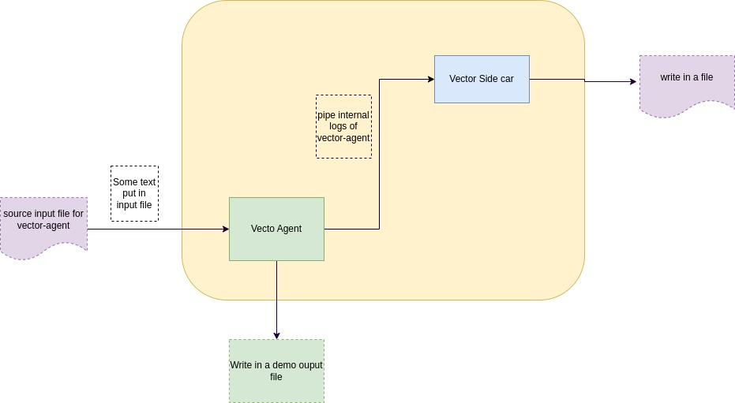

# Create kubernetes cluster
I have created a kubernetes cluster in my local machine with [kind](https://kind.sigs.k8s.io/docs/user/quick-start/)
``` 
kind create cluster
```
# Here is the Flow Diagram


# Install vector-agent as Daemonset
``` 
helm repo add vector https://helm.vector.dev
helm upgrade -i vector vector/vector-agent --devel --values config.yaml --create-namespace  --namespace vector
```

Here inside `config.yaml` file we provided the desired config with which vector-agent is going to run.
```
  data_dir: "/vector-data-dir"
  sources:
    file:
      type: file
      ignore_older_secs: 600
      include:
        - /tmp/demo.log
      read_from: beginning

    internal_log_source:
      type: internal_logs

  sinks:
    filtered_demo_log:
      type: file
      inputs:
        - file
      compression: none
      encoding:
        codec: json
      path: /tmp/vector-error-%Y-%m-%d.log

    vector_agent_sink:
      type: vector
      inputs:
        - internal_log_source
      address: http://vector-tel-agent:9000
```


specially in `sink`, we have added `vector` type which pass this `vector-agent` pod's logs
to another `vector-tel-agent` sidecar's source, there is a server which exposed in port 9000 in 
that `vector-tel-agent` sidecar. We have mentioned the `service name` of that `vector-tel-agent` sidecar inside `address` spec of `sink`.
we will see it in later section when we take a look at `vector-tel-agent` sidecar config. 


# Install vector sidecar
here we are going to create a couple of things
- statefulSet for vector-sidecar
- create service to connect with vector-sidecar
- create configmap which is mount inside vector-sidecar pod. this is the config with which vector-sidecar will run
this is the config that we are using for `vector-tel-agent` sidecar
```
    data_dir: /vector-data-dir
    sources:
      vector_agent_source:
        address: 0.0.0.0:9000
        type: vector
        version: "2"
    sinks:
      filtered_vector_log:
        compression: none
        encoding:
          codec: json
        inputs:
        - vector_agent_source
        path: /tmp/vector-output-%Y-%m-%d.log
        type: file
```


Let's apply the configmap, service, statefulset
``` 
kubectl apply -f tel-agent/vector-ta-sts.yaml
kubectl apply -f tel-agent/tel-agent-config.yaml
kubectl apply -f tel-agent/service.yaml
```
here is the yamls file:
### service.yaml
```
apiVersion: v1
kind: Service
metadata:
  name: vector-tel-agent
  namespace: vector
spec:
  ports:
  - port: 9000
  selector:
    app: vector-ta
  clusterIP: None
``` 
### ConfigMap.yaml
```
apiVersion: v1
kind: ConfigMap
metadata:
  name: vector-tel-agent-config
  namespace: vector
data:
  vector.yaml: |
    data_dir: /vector-data-dir
    sinks:
      filtered_vector_log:
        compression: none
        encoding:
          codec: json
        inputs:
        - vector_agent_source
        path: /tmp/vector-output-%Y-%m-%d.log
        type: file
    sources:
      vector_agent_source:
        address: 0.0.0.0:9000
        type: vector
        version: "2"
```
### StatefulSet.yaml

```
apiVersion: apps/v1
kind: StatefulSet
metadata:
  name: vector-tel-agent
  namespace: vector
spec:
  serviceName: vector-tel-agent
  selector:
    matchLabels:
      app: vector-ta
  template:
    metadata:
      labels:
        app: vector-ta
    spec:
      containers:
      - args:
        - --config-dir
        - /etc/vector/
        env:
        - name: VECTOR_SELF_NODE_NAME
          valueFrom:
            fieldRef:
              apiVersion: v1
              fieldPath: spec.nodeName
        - name: VECTOR_SELF_POD_NAME
          valueFrom:
            fieldRef:
              apiVersion: v1
              fieldPath: metadata.name
        - name: VECTOR_SELF_POD_NAMESPACE
          valueFrom:
            fieldRef:
              apiVersion: v1
              fieldPath: metadata.namespace
        - name: PROCFS_ROOT
          value: /host/proc
        - name: SYSFS_ROOT
          value: /host/sys
        image: timberio/vector:nightly-2022-10-23-debian
        imagePullPolicy: IfNotPresent
        name: vector
        terminationMessagePath: /dev/termination-log
        terminationMessagePolicy: File
        volumeMounts:
        - mountPath: /var/log/
          name: var-log
          readOnly: true
        - mountPath: /var/lib
          name: var-lib
          readOnly: true
        - mountPath: /vector-data-dir
          name: data-dir
        - mountPath: /etc/vector
          name: config-dir
          readOnly: true
        - mountPath: /host/proc
          name: procfs
          readOnly: true
        - mountPath: /host/sys
          name: sysfs
          readOnly: true
      volumes:
      - hostPath:
          path: /var/log/
          type: ""
        name: var-log
      - hostPath:
          path: /var/lib/
          type: ""
        name: var-lib
      - hostPath:
          path: /var/lib/vector/
          type: ""
        name: data-dir
      - name: config-dir
        projected:
          defaultMode: 420
          sources:
          - configMap:
              name: vector-tel-agent-config
      - hostPath:
          path: /proc
          type: ""
        name: procfs
      - hostPath:
          path: /sys
          type: ""
        name: sysfs
```

# AutoScaling StatefulSet
Now we want to autoscale our vector telemetry agent statefulSet.

Before Doing autoscaling, we need to make sure that we have installed [`metrics-server`](https://github.com/kubernetes-sigs/metrics-server#installation). This will help us to compute the resources like: `CPU`, `Memory`, etc.

we need to add the flag `--kubelet-insecure-tls` in `args` To work the metrics-server-api properly in our local `kind` cluster.
``` 
helm repo add metrics-server https://kubernetes-sigs.github.io/metrics-server/

helm upgrade -i metrics-server metrics-server/metrics-server --devel --set args[0]=--kubelet-insecure-tls --create-namespace  --namespace kube-metric
```
now let's deploy the `HorizontalPodAutoscaler`.

```
kubectl apply -f tel-agent/horizontal-auto-scaling.yaml
```

```
apiVersion: autoscaling/v2
kind: HorizontalPodAutoscaler
metadata:
  name: vector-auto-scale
  namespace: vector
spec:
  scaleTargetRef:
    apiVersion: apps/v1
    kind: StatefulSet
    name: vector-tel-agent
  minReplicas: 1
  maxReplicas: 5
  metrics:
  - type: Resource
    resource:
      name: cpu
      target:
        type: Utilization
        averageUtilization: 50
```