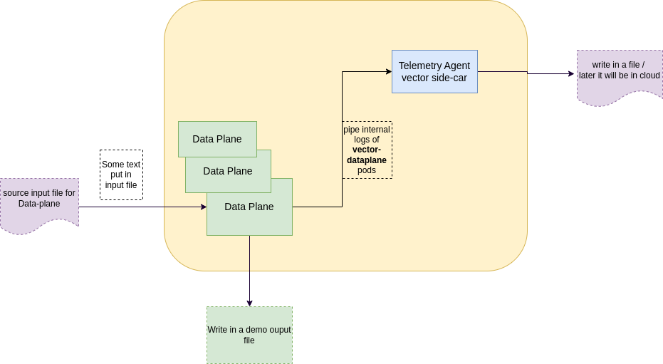

# Create kubernetes cluster
I have created a kubernetes cluster in my local machine with [kind](https://kind.sigs.k8s.io/docs/user/quick-start/)
``` 
kind create cluster
```
# Here is the Flow Diagram


# Clone Repo
``` 
git clone git@github.com:Emon46/vector-demo.git
cd vector-demo
```
# observo metrics-server
Before Doing autoscaling, we need to make sure that we have installed [`metrics-server`](https://github.com/kubernetes-sigs/metrics-server#installation). This will help us to compute the resources like `CPU`, `Memory`, etc.

To run the metrics-server-api properly in our local `kind` cluster, we need to add the flag `--kubelet-insecure-tls` in `args`.

As we want our observo Data-plane Horizontally auto-scalable, that's why are going to install the metrics servers  first.
``` 
helm repo add metrics-server https://kubernetes-sigs.github.io/metrics-server/
helm upgrade -i obsv-metrics-server metrics-server/metrics-server --devel --set args[0]=--kubelet-insecure-tls --create-namespace  --namespace obsv-metrics-server
```
# observo telemetry-agent as Daemonset
Now we want to run our telemetry agent in all nodes of k8s cluster. That's why we will install it as daemon-set. 

``` 
helm repo add vector https://helm.vector.dev
helm upgrade --install obsv-telemetry-agent vector/vector-agent --devel --values telemetry-agent/config.yaml --create-namespace --namespace obsv-telemetry-agent
```
Above helm charts will create following resources:
- `Daemonset`: where our telemetry agent service container will run.
- `Service`: which will expose ports from telemetry service `daemonset`. This will help other services to interact with telemetry agent service
- `ClusterRole`, `ClusterRoleBinding`, `ServiceAccount` : This will set the Authorization rules for telemetry agent `daemonset`'s pods to access other resources in k8s cluster
- `ConfigMap`: contains the configuration with which telemetry agent server is going to run

`config.yaml` file refers the `config` with which `obsv-telemetry-agent` is going to run.
```
image:
  repository: timberio/vector
  pullPolicy: IfNotPresent
  tag: "nightly-2022-10-23-debian"

fullnameOverride: "obsv-telemetry-agent"

service:
  # Whether to create service resource or not.
  enabled: true
  annotations: {}
  type: ClusterIP
  topologyKeys: {}
  ports:
    - name: api
      port: 8686
      protocol: TCP
      targetPort: 8686
    - name: vector-port
      port: 9000
      protocol: TCP
      targetPort: 9000
    
customConfig:
  data_dir: "/vector-data-dir"
  sources:
    obsv_dataplane_logs_source:
      address: 0.0.0.0:9000
      type: vector
      version: "2"

  sinks:
    obsv_dataplane_logs_sink:
      compression: none
      encoding:
        codec: json
      inputs:
        - obsv_dataplane_logs_source
      path: /tmp/observo-data-plane-logs-%Y-%m-%d.log
      type: file

```


# Install vector Dataplane
``` 
helm upgrade  --install obsv-data-plane deploy/helm/data-plane --devel --create-namespace  --namespace obsv-data-plane
```
Above helm chart will create following resources
- `StatefulSet`: which will run Observo Dataplane service.
- `Service`: will create service to communicate with `observo data-plane` service. Now, We have exposed `8686` port for now, later we can add more port if required.
- `configmap`: will create a configmap with which `observo data-plane` services are going to run.
- `ClusterRole`, `ClusterRoleBinding`, `ServiceAccount` : This will set the Authorization rules for observo data-plane  `statefulset`'s pods to access other resources in k8s cluster.
- `HorizontalPodAutoscaler`: This will make `Data-plane statefulSet` horizontally auto scalable.

here is the config:
```
data_dir: /vector-data-dir
sources:
  k8s_logs_source:
    type: kubernetes_logs
    extra_field_selector: metadata.name==load-gen-test
  internal_logs_source:
    type: internal_logs

transforms:
  filter_k8s_logs:
    type: filter
    inputs:
      - k8s_logs_source
    condition: contains(string(.message) ?? "", "no_tag") != true

sinks:
  k8s_logs_sink:
    compression: none
    encoding:
      codec: json
    inputs:
      - filter_k8s_logs
    path: /tmp/source-containers-logs-%Y-%m-%d.log
    type: file
  data_plane_logs_sink:
    type: vector
    inputs:
      - internal_logs_source
    address: http://obsv-telemetry-agent.obsv-telemetry-agent.svc:9000

```

in `sink`, we have added `vector` type which pass this `observo data-plane` pod's logs
to another `obsv-telemetry-agent`'s  `source`. In the telemetry agent, we have exposed a receiver server in port 9000 which will get these logs as input.
Here We have mentioned the k8s `service name` and `service namespace` of our `observo telemetry agent` in `spec.address` of `data_plane_logs_sink`.


here is the yamls file:

### rbac.yaml
``` 
apiVersion: rbac.authorization.k8s.io/v1
kind: ClusterRole
metadata:
  name: obsv-data-plane
rules:
- apiGroups:
  - ""
  resources:
  - namespaces
  - pods
  - nodes
  - configmaps
  verbs:
  - watch
  - get
  - list
  - patch

---
apiVersion: rbac.authorization.k8s.io/v1
kind: ClusterRoleBinding
metadata:
  name: obsv-data-plane
roleRef:
  apiGroup: rbac.authorization.k8s.io
  kind: ClusterRole
  name: obsv-data-plane
subjects:
- kind: ServiceAccount
  name: obsv-data-plane
  namespace: obsv-data-plane
---
apiVersion: v1
kind: ServiceAccount
metadata:
  name: obsv-data-plane
  namespace: obsv-data-plane

```

### service.yaml
```
apiVersion: v1
kind: Service
metadata:
  name: obsv-data-plane
  namespace: obsv-data-plane
  annotations:
    meta.helm.sh/release-name: obsv-data-plane
    meta.helm.sh/release-namespace: obsv-data-plane
  labels:
    app.kubernetes.io/instance: obsv-data-plane
    app.kubernetes.io/name: data-plane
spec:
  type: ClusterIP
  ports:
  - name: api
    port: 8686
    protocol: TCP
    targetPort: 8686
  selector:
    app.kubernetes.io/instance: obsv-data-plane
    app.kubernetes.io/name: data-plane

``` 
### ConfigMap.yaml
```
apiVersion: v1
kind: ConfigMap
metadata:
  name: obsv-data-plane-config
  namespace: obsv-data-plane
data:
  vector.yaml: |
    data_dir: /vector-data-dir
    sources:
      k8s_logs_source:
        type: kubernetes_logs
        extra_field_selector: metadata.name==load-gen-test
      internal_logs_source:
        type: internal_logs

    transforms:
      filter_k8s_logs:
        type: filter
        inputs:
          - k8s_logs_source
        condition: contains(string(.message) ?? "", "no_tag") != true

    sinks:
      k8s_logs_sink:
        compression: none
        encoding:
          codec: json
        inputs:
          - filter_k8s_logs
        path: /tmp/source-containers-logs-%Y-%m-%d.log
        type: file
      data_plane_logs_sink:
        type: vector
        inputs:
          - internal_logs_source
        address: http://obsv-telemetry-agent.obsv-telemetry-agent.svc:9000

```
### StatefulSet.yaml

```
apiVersion: apps/v1
kind: StatefulSet
metadata:
  annotations:
    meta.helm.sh/release-name: obsv-data-plane
    meta.helm.sh/release-namespace: obsv-data-plane
  labels:
    app.kubernetes.io/instance: obsv-data-plane
    app.kubernetes.io/name: data-plane
  name: obsv-data-plane
  namespace: obsv-data-plane
spec:
  replicas: 1
  selector:
    matchLabels:
      app.kubernetes.io/instance: obsv-data-plane
      app.kubernetes.io/name: data-plane
  serviceName: obsv-data-plane
  template:
    metadata:
      labels:
        app.kubernetes.io/instance: obsv-data-plane
        app.kubernetes.io/name: data-plane
    spec:
      containers:
      - args:
        - --watch-config
        - --config-dir
        - /etc/vector/
        command:
        - vector
        env:
        - name: VECTOR_SELF_NODE_NAME
          valueFrom:
            fieldRef:
              apiVersion: v1
              fieldPath: spec.nodeName
        - name: VECTOR_SELF_POD_NAME
          valueFrom:
            fieldRef:
              apiVersion: v1
              fieldPath: metadata.name
        - name: VECTOR_SELF_POD_NAMESPACE
          valueFrom:
            fieldRef:
              apiVersion: v1
              fieldPath: metadata.namespace
        - name: PROCFS_ROOT
          value: /host/proc
        - name: SYSFS_ROOT
          value: /host/sys
        image: timberio/vector:nightly-2022-10-23-debian
        imagePullPolicy: IfNotPresent
        name: data-plane
        resources:
          requests:
            cpu: 100m
            memory: 128Mi
        terminationMessagePath: /dev/termination-log
        terminationMessagePolicy: File
        volumeMounts:
        - mountPath: /var/log/
          name: var-log
          readOnly: true
        - mountPath: /var/lib
          name: var-lib
          readOnly: true
        - mountPath: /vector-data-dir
          name: data-dir
        - mountPath: /etc/vector
          name: config-dir
          readOnly: true
        - mountPath: /host/proc
          name: procfs
          readOnly: true
        - mountPath: /host/sys
          name: sysfs
          readOnly: true
      restartPolicy: Always
      serviceAccount: obsv-data-plane
      serviceAccountName: obsv-data-plane
      terminationGracePeriodSeconds: 30
      volumes:
      - hostPath:
          path: /var/log/
          type: ""
        name: var-log
      - hostPath:
          path: /var/lib/
          type: ""
        name: var-lib
      - hostPath:
          path: /var/lib/vector/
          type: ""
        name: data-dir
      - name: config-dir
        projected:
          defaultMode: 420
          sources:
          - configMap:
              name: obsv-data-plane-config
      - hostPath:
          path: /proc
          type: ""
        name: procfs
      - hostPath:
          path: /sys
          type: ""
        name: sysfs
  updateStrategy:
    rollingUpdate:
      partition: 0
    type: RollingUpdate

```

HorizontalPodAutoscaler's yaml:
```
apiVersion: autoscaling/v2
kind: HorizontalPodAutoscaler
metadata:
  annotations:
    meta.helm.sh/release-name: obsv-data-plane
    meta.helm.sh/release-namespace: obsv-data-plane
  labels:
    app.kubernetes.io/instance: obsv-data-plane
    app.kubernetes.io/name: data-plane
  name: obsv-data-plane-autoscale
  namespace: obsv-data-plane
spec:
  maxReplicas: 10
  metrics:
  - resource:
      name: memory
      target:
        averageUtilization: 80
        type: Utilization
    type: Resource
  - resource:
      name: cpu
      target:
        averageUtilization: 80
        type: Utilization
    type: Resource
  minReplicas: 1
  scaleTargetRef:
    apiVersion: apps/v1
    kind: StatefulSet
    name: obsv-data-plane
```